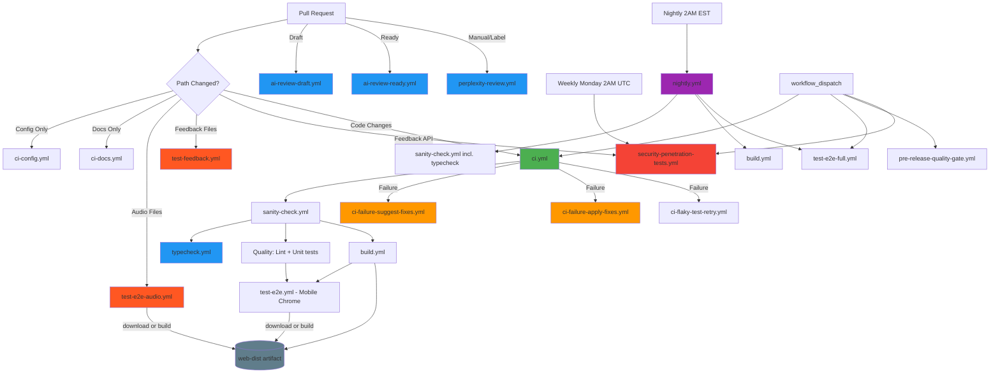

# GitHub Actions Workflows

## Workflow Architecture

## Active workflows

### Core CI Pipeline
- `ci.yml` → **main CI for PRs** (sanity+typecheck, lint, unit tests, build, E2E on Mobile Chrome) - **Cost optimized**
- `sanity-check.yml` → pre-flight checks (package integrity, dependencies, syntax) **plus** calls `typecheck.yml` — no standalone PR trigger to prevent duplicate runs
- `typecheck.yml` → TypeScript type checking; called by `sanity-check.yml` and also triggerable manually
- `build.yml` → reusable build workflow that publishes the `web-dist` artifact; called by `ci.yml` and `nightly.yml`
- `test-e2e.yml` → reusable E2E workflow called by `ci.yml`; **downloads `web-dist` artifact** from `build.yml` or builds locally as fallback
- `nightly.yml` → **comprehensive testing** (runs daily at 2 AM EST, calls sanity+typecheck, build, test-e2e-full.yml)

### Path-Triggered Specialized Testing
- `test-e2e-audio.yml` → **audio-specific E2E** (chromium + webkit + Mobile Safari, only on audio file changes); **reuses `web-dist` artifact** if available, otherwise builds locally
- `test-feedback.yml` → **feedback/database tests** (only on feedback system changes)
- `ci-config.yml` → **config validation** (only on config file changes)
- `ci-docs.yml` → **documentation validation** (only on markdown changes)
- `security-penetration-tests.yml` → **API security tests** (only on `functions/api/feedback.js` changes, plus weekly schedule)

### Reusable Test Workflows
- `test-unit.yml` → reusable unit test workflow
- `test-components.yml` → reusable component/page test workflow
- `test-e2e.yml` → reusable E2E workflow (called by `ci.yml`); **downloads `web-dist` artifact** or builds as fallback; configurable `project` input (default: `"Mobile Chrome"`)
- `test-e2e-full.yml` → **nightly + manual** comprehensive cross-browser E2E (chromium + firefox + webkit, with sharding)

### AI-Powered Workflows
- `ai-review-draft.yml` → quick GPT-based review for draft PRs
- `ai-review-ready.yml` → thorough Claude-based review for ready PRs
- `perplexity-review.yml` → Perplexity QA review for ready PRs
- `claude_comment.yml` → `@claude` comment assistant
- `ci-failure-apply-fixes.yml` → AI-generated fixes for CI failures (auto-applies)
- `ci-failure-suggest-fixes.yml` → AI-generated fix suggestions for CI failures
- `ci-flaky-test-retry.yml` → flaky test analysis and auto-retry

### Quality Gates
- `pre-release-quality-gate.yml` → **manual-only** comprehensive pre-release validation

## Cost Optimization Strategy

### Fast Feedback on PRs (7-10 minutes)

**`ci.yml` runs on every PR:**
- ✅ Sanity checks + TypeScript typecheck (via `sanity-check.yml`)
- ✅ Lint + unit tests
- ✅ Build once (via reusable `build.yml` — no duplicated steps)
- ✅ E2E on **Mobile Chrome only** via `test-e2e.yml` (reuses the `web-dist` artifact)
- ⚡ Fast feedback (~7-10 min)
- 💰 Low cost

**No duplicate jobs:**
- `sanity-check.yml` is called by `ci.yml`; it has no standalone PR trigger
- `typecheck.yml` is called by `sanity-check.yml`; no separate PR trigger needed
- `build.yml` is called by `ci.yml`; `test-e2e.yml` downloads that artifact — no rebuild
- `test-e2e-audio.yml` also tries to download `web-dist` before building

### Path-Triggered Enhancements (adds 1-9 minutes when relevant)

**When you change audio files:**
- `test-e2e-audio.yml` runs automatically
- Tests: audio-routing.spec.js on chromium + webkit + Mobile Safari
- Rationale: Safari/WebKit audio handling is significantly different
- Time: ~9 min additional
- Triggers: ~10% of PRs

**When you change feedback/database files:**
- `test-feedback.yml` runs automatically
- Tests: feedback integration + database tests
- Time: ~2-3 min additional
- Triggers: ~10-15% of PRs

**When you change feedback API (`functions/api/feedback.js`):**
- `security-penetration-tests.yml` runs automatically
- Tests: XSS, SQL injection, CORS, input validation, error handling
- Time: ~1-3 min additional
- Triggers: ~5-10% of PRs

### Comprehensive Testing (15-20 minutes, daily)

**`nightly.yml` runs every night at 2 AM EST:**
- Calls `test-e2e-full.yml`
- Tests ALL specs on chromium + firefox + webkit
- With sharding for speed
- Catches integration issues, dependency drift
- Off-peak execution

### Manual Comprehensive Testing

**`test-e2e-full.yml` (workflow_dispatch only):**
- Run manually before releases
- Run manually when investigating browser bugs
- All browsers + configurable sharding

**Result:** 60-70% cost reduction on typical PRs vs multi-browser on every PR

## Trigger Condition Reference

| Workflow | Pull Request | Push | Schedule | Manual | On Failure | Comment | Path Filters |
|----------|-------------|------|----------|--------|------------|---------|-------------|
| `ci.yml` | ✅ (main/master) | ❌ | ❌ | ✅ | - | - | Excludes docs/config |
| `typecheck.yml` | ❌ (runs inside ci.yml) | ❌ | ❌ | ✅ | - | - | - |
| `nightly.yml` | ❌ | ❌ | ✅ Daily 2AM EST | ✅ | - | - | - |
| `test-e2e-audio.yml` | ✅ (main/master) | ❌ | ❌ | ✅ | - | - | Audio files only |
| `test-feedback.yml` | ✅ (main/master) | ❌ | ❌ | ✅ | - | - | Feedback files only |
| `security-penetration-tests.yml` | ✅ (main/master) | ❌ | ✅ Weekly Mon 2AM UTC | ✅ | - | - | `functions/api/feedback.js` only |
| `ci-config.yml` | ✅ (main/master) | ❌ | - | ✅ | - | - | Config files only |
| `ci-docs.yml` | ✅ (main/master) | ❌ | - | ✅ | - | - | Markdown files only |
| `sanity-check.yml` | Called by ci.yml/nightly.yml (includes typecheck) | - | - | ✅ | - | - | - |
| `typecheck.yml` | Called by sanity-check.yml | - | - | ✅ | - | - | - |
| `build.yml` | Called by ci.yml/nightly.yml | - | - | ✅ | - | - | - |
| `test-unit.yml` | Called by workflows | - | - | - | - | - | - |
| `test-components.yml` | Called by workflows | - | - | - | - | - | - |
| `test-e2e.yml` | Called by ci.yml (reuses web-dist artifact) | - | - | ✅ | - | - | - |
| `test-e2e-full.yml` | ❌ | ❌ | Called by nightly | ✅ Manual only | - | - | - |
| `ci-failure-suggest-fixes.yml` | - | - | - | - | ✅ `ci.yml` fails | - | - |
| `ci-failure-apply-fixes.yml` | - | - | - | - | ✅ `ci.yml` fails (non-draft) | - | - |
| `ci-flaky-test-retry.yml` | - | - | - | - | ✅ `ci.yml` fails | - | - |
| `ai-review-draft.yml` | ✅ Draft only | ❌ | - | ✅ | - | - | Code files only |
| `ai-review-ready.yml` | ✅ `ready_for_review` | ❌ | - | ✅ | - | - | Code files only |
| `perplexity-review.yml` | ✅ `ready_for_review` | ❌ | - | ✅ | - | - | - |
| `claude_comment.yml` | - | - | - | - | - | ✅ `@claude` | - |
| `pre-release-quality-gate.yml` | ❌ | ❌ | ❌ | ✅ Manual only | - | - | - |

**Legend:**
- ✅ = Workflow triggers on this event
- ❌ = Workflow explicitly does NOT trigger
- `-` = Not applicable/not configured

## CI Design Philosophy

### Tiered Testing Strategy

**Tier 1: Fast PR Validation (~7-10 min)**
- Sanity checks + TypeScript typecheck in parallel (via `sanity-check.yml`)
- Lint + unit tests in parallel with build
- Build once — E2E reuses the `web-dist` artifact via `test-e2e.yml`
- Mobile Chrome E2E only (covers 80%+ of users — mobile-first app)

**Tier 2: Path-Triggered Specialization (+1-9 min when applicable)**
- Audio E2E: Only when audio code changes (Safari/WebKit critical); reuses artifact if available
- Feedback tests: Only when feedback/DB code changes
- Security tests: Only when feedback API changes
- Config/docs validation: Only when those files change

**Tier 3: Comprehensive Nightly (~15-20 min, daily)**
- All browsers (chromium, firefox, webkit)
- All E2E specs
- Catches integration issues
- Off-peak execution

**Tier 4: Manual Pre-Release (~20-30 min)**
- Full quality gate
- All browsers with sharding
- Word coverage validation

### Why This Works

1. **Fast feedback** - Developers get results in 7-10 min for typical PRs
2. **Typecheck at the gate** - `sanity-check.yml` calls `typecheck.yml` so type errors fail early
3. **No duplicate runs** - `sanity-check.yml` and `typecheck.yml` have no standalone PR triggers
4. **Build once, reuse everywhere** - `build.yml` uploads `web-dist`; `test-e2e.yml` and `test-e2e-audio.yml` download it (fall back to building only if unavailable)
5. **Consistent caching** - All jobs use `./.github/actions/setup-node` for `node_modules` caching
6. **Cost effective** - 60-70% reduction vs multi-browser on every PR
7. **No gaps** - Nightly comprehensive testing catches everything
8. **Flexible** - Manual comprehensive suite available anytime

## CI design

`ci.yml` is the single source of truth for checks required on PRs:

1. **sanity**: calls reusable `sanity-check.yml` which runs two parallel jobs:
   - **sanity** job: package integrity, file existence, JS syntax checks
   - **typecheck** job: calls `typecheck.yml` for TypeScript validation
2. **quality**: lint + unit tests (depends on `sanity` passing)
3. **build**: calls reusable `build.yml`, uploads `web-dist` artifact (runs in parallel with `quality`)
4. **e2e**: calls reusable `test-e2e.yml`; downloads the `web-dist` artifact from step 3 (no rebuild)

All jobs use the shared `./.github/actions/setup-node` action for consistent Node.js setup and `node_modules` caching.

## TypeScript Type Checking

### How Typechecking Works

TypeScript type checking is part of the **sanity** gate. `sanity-check.yml` includes a `typecheck` job that calls `typecheck.yml`. This means type errors fail fast — before lint or unit tests run.

- ✅ Runs on all code-change PRs as part of `sanity-check.yml` (called by `ci.yml`)
- ✅ Also runs in nightly via `nightly.yml` → `sanity-check.yml`
- ✅ Uses `npm run typecheck` (`tsc --noEmit` with strict tsconfig)
- ✅ Manually triggerable via `workflow_dispatch` on `typecheck.yml`

### Type Check Configuration

The workflow uses `npm run typecheck` which:
- Executes `tsc --noEmit` (no compilation, type checking only)
- Uses `tsconfig.json` with strict mode enabled
- Validates `.ts` and `.tsx` files
- Supports gradual migration with `allowJs: true`

## When are E2E Tests Called?

| Scenario | Workflow | E2E Runner | Browser(s) |
|----------|----------|------------|------------|
| Every PR (code changes) | `ci.yml` → `test-e2e.yml` | Mobile Chrome | Chromium (mobile viewport) |
| PR touching audio files | `test-e2e-audio.yml` | chromium, webkit, Mobile Safari | Multi-browser |
| Nightly (scheduled) | `nightly.yml` → `test-e2e-full.yml` | All browsers × 2 shards | Chromium + Firefox + WebKit |
| Manual / pre-release | `test-e2e-full.yml` directly | All browsers | Configurable sharding |

**Key:** `test-e2e.yml` is the reusable single-browser E2E runner. It downloads the `web-dist` artifact built by `build.yml` in the same workflow run — no rebuild needed.

### How to run manually

1. Navigate to **Actions** → **E2E Tests - Full Cross-Browser**
2. Click **Run workflow**
3. Choose shard count (1-3, higher = faster but more expensive)
4. Tests will run on all three browsers: Chromium, Firefox, and WebKit (Safari)

**Cost:** ~3-9× more expensive than regular E2E (3 browsers × 1-3 shards each)

## Troubleshooting

### TypeScript Type Check Failures

**Problem:** CI `sanity` job fails with type errors (from the nested `typecheck` job).

**Solutions:**
1. **Run locally**: Execute `npm run typecheck` to see detailed errors
2. **Check tsconfig.json**: Ensure configuration matches CI environment
3. **Install dependencies**: Run `npm ci` to match exact CI dependency versions
4. **Review recent changes**: Check if recent PRs introduced type errors
5. **Check IDE settings**: Ensure VS Code uses workspace TypeScript version
6. **Gradual migration**: Use `// @ts-expect-error` for known migration issues (temporary)

**Common Type Errors:**
- **Missing types**: Install `@types/*` packages for third-party libraries
- **Implicit any**: Add explicit type annotations or disable `noImplicitAny` temporarily
- **Strictness issues**: Review `strict` mode settings in `tsconfig.json`
- **Import errors**: Ensure path aliases (`@/*`) are configured correctly

### CI Not Running on PR

**Problem:** Pull request opened but no workflows are running.

**Solutions:**
1. **Check path filters**: If you only changed docs or config files, `ci.yml` won't run (by design). Check if `ci-docs.yml` or `ci-config.yml` ran instead.
2. **Check branch target**: CI only runs on PRs to `main` or `master` branches.
3. **Check workflow permissions**: Ensure your GitHub token has appropriate permissions.
4. **Check concurrency groups**: If multiple PRs from the same branch exist, older workflow runs may be cancelled.

### Audio Tests Not Running

**Problem:** Changed audio code but `test-e2e-audio.yml` didn't run.

**Solutions:**
1. **Check path filters**: Workflow only triggers on specific audio files:
   - `src/lib/audioSessionManager.js`
   - `src/hooks/useSpeechSynthesis.js`
   - `src/hooks/useVoiceRecognition.js`
   - `src/pages/Home.jsx`
   - `tests/e2e/audio-routing.spec.js`
2. **Check if CI ran**: `ci.yml` always runs audio tests on Mobile Chrome
3. **Run manually**: Use workflow_dispatch to trigger manually

### Security Tests Not Running

**Problem:** Changed feedback code but `security-penetration-tests.yml` didn't run.

**Solutions:**
1. **Check path filter**: Workflow only triggers on `functions/api/feedback.js` changes
2. **Other feedback files**: Changes to UI feedback components don't trigger security tests
3. **Weekly schedule**: Tests also run every Monday at 2 AM UTC automatically
4. **Run manually**: Use workflow_dispatch to trigger manually

### Only Mobile Chrome Tested on PR

**Problem:** Want to test on Safari/Firefox before merge.

**Solutions:**
1. **This is by design** - Cost optimization for fast feedback
2. **Audio changes**: `test-e2e-audio.yml` automatically tests Safari/WebKit
3. **Manual testing**: Run `test-e2e-full.yml` manually from Actions tab
4. **Nightly testing**: Comprehensive tests run every night
5. **Pre-release**: Always run full suite before deploying

### Nightly Tests Failing

**Problem:** Nightly comprehensive tests fail on main branch.

**Solutions:**
1. **Check recent merges**: Review recently merged PRs
2. **Check browser-specific**: Failure may be Firefox or WebKit specific
3. **Run locally**: `npx playwright test --project=firefox` or `--project=webkit`
4. **Check dependencies**: Dependency updates may break browser compatibility
5. **Review PR tests**: Ensure audio PRs ran audio workflow (Safari testing)

### CI Fails Immediately

**Problem:** CI workflow fails in sanity-check step.

**Solutions:**
1. **Check package.json**: Run `npm install` locally to verify dependencies resolve.
2. **Check syntax**: Run `npm run lint` locally to catch syntax errors.
3. **Check file structure**: Ensure required files exist (`package.json`, `vite.config.js`, etc.).
4. **Review sanity-check logs**: The first failure usually indicates the root cause.

### E2E Tests Fail Locally But Pass in CI (or vice versa)

**Problem:** Tests behave differently between local and CI environments.

**Solutions:**
1. **Check Playwright version**: Run `npx playwright --version` locally and compare to CI.
2. **Check browser versions**: CI uses specific Playwright browser versions.
3. **Check viewport size**: CI may use different default viewport dimensions.
4. **Check timing**: CI runners may be slower/faster than local machine. Add appropriate waits.
5. **Check environment variables**: Verify all required env vars are set in both environments.
6. **Clear Playwright cache**: Run `npx playwright install --with-deps` locally.

### Cost Concerns

**Problem:** GitHub Actions costs are higher than expected.

**Solutions:**
1. **This workflow is optimized** - 60-70% cost reduction vs multi-browser PRs
2. **Review workflow frequency**: Check how often workflows run per PR/day.
3. **Check manual runs**: Ensure `test-e2e-full.yml` is only run when needed
4. **Monitor AI review costs**: Track OpenAI and Anthropic API usage
5. **Check concurrency settings**: Ensure `cancel-in-progress: true` to avoid redundant runs
6. **Review path filters**: Ensure specialized workflows only run when relevant

### Getting Help

**Still stuck?**

1. **Check workflow logs**: Navigate to Actions → click failed workflow → review detailed logs.
2. **Use `@claude` assistant**: Comment `@claude help debug this CI failure` on your PR.
3. **Manual workflow dispatch**: Try running workflows manually with different parameters.
4. **Review recent changes**: Compare your branch to working examples in main.
5. **Check GitHub Status**: Visit [githubstatus.com](https://www.githubstatus.com) for service disruptions.
